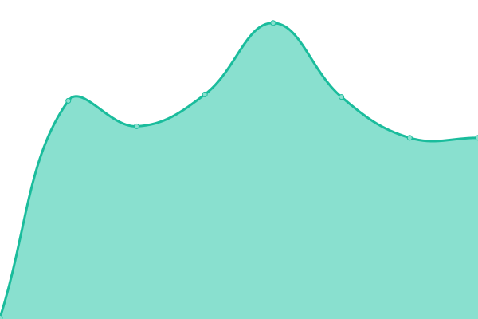

# [📈 Live Status](https://lorenzogirardi.github.io/status): <!--live status--> **🟥 Complete outage**

This repository contains the open-source uptime monitor and status page for [lorenzo](https://www.k8s.it), powered by [Upptime](https://github.com/upptime/upptime).

With [Upptime](https://upptime.js.org), you can get your own unlimited and free uptime monitor and status page, powered entirely by a GitHub repository. We use [Issues](https://github.com/lorenzogirardi/status/issues) as incident reports, [Actions](https://github.com/lorenzogirardi/status/actions) as uptime monitors, and [Pages](https://lorenzogirardi.github.io/status) for the status page.

<!--start: status pages-->
<!-- This summary is generated by Upptime (https://github.com/upptime/upptime) -->
<!-- Do not edit this manually, your changes will be overwritten -->
<!-- prettier-ignore -->
| URL | Status | History | Response Time | Uptime |
| --- | ------ | ------- | ------------- | ------ |
|  [k8s_www](https://www.k8s.it) | 🟥 Down | [k8s-www.yml](https://github.com/lorenzogirardi/status/commits/HEAD/history/k8s-www.yml) | 

 116ms
     
 | 

<a href="https://lorenzogirardi.github.io/status/history/k8s-www">0.00%</a>
    

|  [k8s_services_root](https://services.k8s.it) | 🟥 Down | [k8s-services-root.yml](https://github.com/lorenzogirardi/status/commits/HEAD/history/k8s-services-root.yml) | 

 103ms
     
 | 

<a href="https://lorenzogirardi.github.io/status/history/k8s-services-root">0.00%</a>
    

<!--end: status pages-->

[**Visit our status website →**](https://lorenzogirardi.github.io/status)

## 📄 License

- Powered by: [Upptime](https://github.com/upptime/upptime)
- Code: [MIT](./LICENSE) © [lorenzo](https://www.k8s.it)
- Data in the `./history` directory: [Open Database License](https://opendatacommons.org/licenses/odbl/1-0/)
